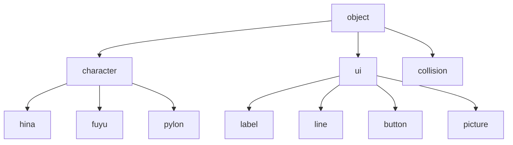

# ゲームエンジン

## 登場人物

- 飛奈
- 冬
- 三角コーン
- タイトルロゴ
- 文字列
- 線
- ボタン

## いる機能

- 扱うのが簡単な当たり判定機能
- アニメーション
- アニメーション切り替え
- シーン切り替え
- シーン切り替えエフェクト数種
- インプット取得
- レイヤー機能
- オブジェクト情報取得
- コリジョンエディタとかほしいかも

## 中身の要望

- init関数、update関数は`super()`なしで使いたい
- 継承先クラスが継承元クラスのことを考えなくて済むようにしたい

## クラス関係図

### クラス考える

飛奈にほしいプロパティ

- 座標
- アニメーション用画像配列（id付きで複数保持できる）
- 当たり判定
- 名前
- ID
- ステータス（走ってる、飛んでる、死んだ、etc.

冬にほしいプロパティ

- 座標
- アニメーション用画像配列（id付きで複数保持できる）
- 当たり判定
- 名前
- ID
- キャラクタータイプ
- ステータス（飛んでる

三角コーンにほしいプロパティ

- 座標
- 画像（要素１の配列でも大丈夫
- 当たり判定（三角形なところがポイント
- 名前
- ID
- キャラクタータイプ
- ステータス（いる？

コリジョンにほしいプロパティ

- 頂点配列
- id

ラベルにほしいプロパティ

- 文字列
- id
- サイズ
- 座標
- 色
- 左寄せか右寄せか

線にほしいプロパティ

- 座標（始点、終点
- 色
- 太さ
- id

ボタンにほしいプロパティ

- おもいつかない(^^;;;

画像にほしいプロパティ

- id
- サイズ
- リサイズの種類
- 座標